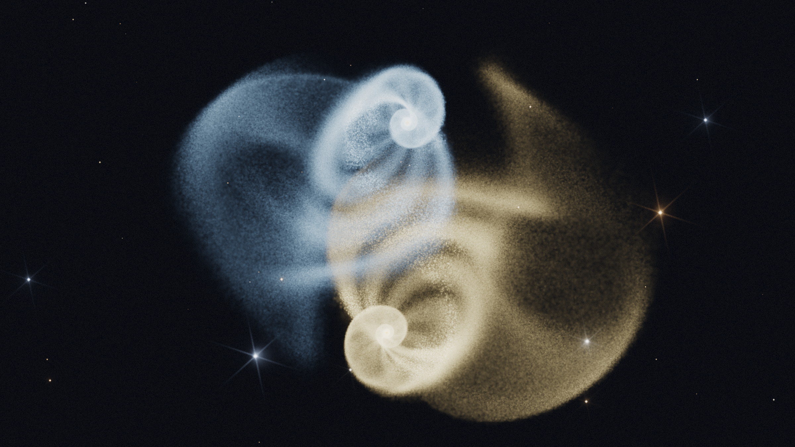

# Sillage

A galaxy collision simulator for Apple Silicon, built for the picture rather than the
particle count.



## Two levels of physics

The solver is chosen per scene, so the cheap model and the accurate one share the same
configuration, the same particle storage and the same renderer.

| Level | Model | Cost | State |
|---|---|---|---|
| 1 | Massless test particles in rigid analytic potentials (Toomre & Toomre, 1972) | O(N) | implemented, CPU and GPU |
| 2 | Self-gravitating particles on a Barnes-Hut tree | O(N log N) | implemented, GPU |

Level 1 is deliberately first: it reproduces the bridges and tails that make an encounter
worth looking at, and it is cheap enough that the particle budget goes entirely into what is
visible. Each galaxy's bulge and dark halo are an analytic potential rather than particles,
so no part of the budget is spent on mass that never reaches a pixel.

## Level 2: self-gravity

Particles carry mass and attract each other through a Barnes-Hut tree. The tree is built on
the CPU in Morton order and traversed on the GPU: the build wants a radix sort and a
pointerless hierarchy, which is the awkward half of a GPU N-body solver, while the traversal
is where the time actually goes. Unified memory means the CPU reads the same buffer the GPU
writes, so the build costs no transfer.

Threads traverse in Morton order rather than in sampling order. Neighbouring lanes then take
almost the same path through the tree, which cut the force kernel from 154 ms to 69 ms at one
million particles.

Two things this mode needs that level 1 does not:

**Initial conditions.** A cold disk fragments within an orbit once self-gravity is on. The
velocity structure comes from Toomre's criterion instead: the radial dispersion is set by the
requested Q, the azimuthal dispersion follows from the epicyclic ratio rather than being
chosen, and the mean rotation lags the circular speed by the asymmetric drift. Measured over
roughly one orbit on an isolated disk carrying 60% of the mass, Q = 0.4 thickens it by a
factor 1.6 while Q = 1.4 holds it to 1.24.

**A rigid halo.** The dark halo stays an analytic potential riding on its own galaxy's centre
of mass. It carries most of the mass but none of the inertia, so there is no dynamical
friction against it and two galaxies keep orbiting instead of settling into a merger. Live
halos would fix that at the cost of five to ten times more particles, none of them visible.

The disks then grow their own bars and spiral arms, so the render-time density wave is
switched off in this mode: the structure is real rather than painted.

## Measured on an Apple Silicon

Level 1:

| | Per step | Notes |
|---|---|---|
| CPU reference, 1 M | 17.4 ms | single threaded, used as the correctness reference |
| GPU, 1 M | 0.102 ms | 170x the CPU path |
| GPU, 5 M | 0.893 ms | over 1000 steps per second |
| GPU, 16 M | 2.85 ms | |

Level 2, at an opening angle of 0.6:

| | Per step | Tree build | Force traversal |
|---|---|---|---|
| 1 M | 84 ms | 19 ms | 64 ms |
| 3 M | 352 ms | 56 ms | 294 ms |

The tree build went from 133 ms to 56 ms at three million particles by parallelising the
Morton codes and the leaf accumulation, halving the number of radix passes, materialising the
codes in sorted order so the node split scans linearly instead of chasing a permutation, and
shrinking the node from 48 bytes to 32. Total step time only improved by about a third,
because the force traversal dominates and is bound by divergence rather than by node size.
Sharing one stack across a SIMD group is the next thing worth trying there.

## Watching a slow simulation

At three hundred milliseconds a step, stepping inside the draw loop makes the camera, the
sliders and the whole interface run at that rate too. Recording separates them: the solver
advances on its own queue while the viewer plays back from memory at the display rate, with
scrubbing and without touching the physics.

Snapshots are three 16-bit fixed-point values per particle inside each frame's own bounding
box. Over a 200 kpc box that resolves 0.003 kpc, far below the force softening, for six bytes
a particle instead of twelve. Playback blends the two surrounding snapshots on the GPU, so a
run captured at three steps per second still moves continuously.

| Particles | Per snapshot | 300 snapshots |
|---|---|---|
| 1 M | 6 MB | 1.8 GB |
| 3 M | 18 MB | 5.4 GB |
| 5 M | 30 MB | 9 GB |

The interactive app holds 3 million particles at 2.4 ms per frame, which is the display
refresh rate rather than a GPU limit. Past roughly 20 million particles the extra points
land in pixels that are already smooth, so the picture stops improving.

## The app

```
./scripts/dev.sh app && open .build/dev/Sillage.app
```

It opens on a setup screen. Add or remove galaxies, and for each one choose its kind, mass
profile, particle count, mass, scale radius, size, extent, thickness, velocity dispersion,
inclination, position angle, spin, position and velocity. The footer shows the total particle
count and an estimate of the cost per frame, so the count can be chosen knowing whether the
run will stay real time.

Starting the run switches to the live view: drag to orbit, scroll to zoom, space to pause.
The side panel there only holds things that apply immediately, brightness and stretch and
bloom and camera, plus a button back to the setup screen. Nothing heavy is built until the
run starts, so the setup screen opens instantly.

### Galaxy kinds

| Kind | Distribution |
|---|---|
| Spirale | Thin rotating disk with a logarithmic spiral density modulation, sampled by rejection so the radial profile is untouched |
| Disque | Thin rotating disk, featureless |
| Globulaire | Pressure-supported sphere, no ordered rotation. Plummer spheres are drawn from their exact distribution function; Hernquist uses the Jeans dispersion |

Spin matters more than it looks. Prograde coplanar passages raise the long symmetric tails;
retrograde ones stay dull.

Set per galaxy: colour, clumpiness, arm irregularity, dust share, star-forming share, bulge
extent, arm count, arm contrast and pitch.

## Offline rendering

```
./scripts/dev.sh render --particles 16000000 --steps 4000 --width 2400 --height 1350 --out out/frame.png
```

Add `--frames N` for an image sequence to encode into video. Rendering offline beats a
screen recording: any resolution, no capture compression, no dropped frames.

Useful flags: `--preset merger|flyby|disk`, `--solver restricted|barnes-hut|cpu`,
`--theta`, `--softening`, `--seed`, `--radius`,
`--elevation`, `--brightness`, `--stretch`, `--saturation`, `--bloom`, `--dust`, `--stars`,
`--star-size`, `--arms`, `--supersample`.

## Rendering

### Adaptive smoothing

A galaxy holds on the order of a hundred billion stars, so every pixel of a real image
contains millions of them and the surface is continuous. A million particles splatted at a
fixed size resolves the particles instead, which is why a simulation reads as a point cloud
however many points it has, and why adding particles does not fix it.

Each particle therefore carries a smoothing length equal to its own local interparticle
spacing, taken from the Barnes-Hut tree: a leaf holding n particles in a cell of width w
implies a density, and the radius enclosing the wanted number of neighbours follows. Its light
is then spread over the kernel's area in kiloparsecs rather than in pixels, which gives
surface brightness, the quantity a telescope actually measures, and which stays put when the
camera or the resolution changes.

### The instrument

A telescope's secondary supports and, on a segmented mirror, the segment edges throw light
into a fixed set of directions: six arms for a hexagonal mirror, four for a Cassegrain spider.
A gather pass along those directions from the bright pass reproduces them. On top of that the
frame carries a sky background and detector noise, both added in linear signal before tone
mapping. Putting the noise back is counterintuitive but it is what stops an image looking
synthetic.

### Splatting

Particles are splatted into two additive targets: emitted light in `rgba16Float`, and the
optical depth of intervening dust in `r16Float`. Resolving from the supersampled buffers
applies extinction on the way down, more strongly in blue than in red, which is what makes a
dust lane read brown rather than grey. A Kawase dual-filter bloom pyramid is built from the
result, and the sum goes through a logarithmic stretch before ACES tone mapping. The stretch
is what astronomical imaging uses: a galaxy core is three orders of magnitude brighter than
its tidal debris, and a filmic curve alone flattens the cores into featureless discs.

There is no depth sorting, so the dust column includes grains behind the stars as well as in
front. Roughly half lies in front, so the depth is halved and clamped; without the clamp an
encounter that stacks both galaxies along the line of sight goes black.

Each galaxy emits in a single colour of its own, so material pulled out of one and wrapped
around the other stays legible after the encounter has mixed them. Star-forming knots are
brighter rather than differently coloured. Dust absorbs instead of emitting. Foreground field
stars are drawn from a steep magnitude law with a tight core and diffraction spikes on the
brightest.

### Clumping

Stars are placed in a hierarchy: about a hundred giant complexes, five thousand clumps within
them, and stars within those, with sizes following a steep power law so a few are large and
most are small. Roughly half the disk stays smooth underneath. Clumps are generated already
stretched along the direction of rotation, because differential rotation shears a cloud into
an arc within a fraction of an orbit, and a disk of round blobs does not look like a galaxy.

The result is flocculent structure at every scale rather than the airbrushed look of drawing
every particle straight from a smooth profile.

### Spiral arms as a density wave

Arms baked into the initial conditions wind up within about one orbit, because a disk rotates
differentially. Real arms are a density wave that turns at its own slower speed while stars
pass through it, which is why a galaxy keeps two clean arms far longer than any material
pattern could. The renderer evaluates that pattern at each particle's current position and
modulates brightness and extinction with it, so the arms stay sharp and star formation
happens where the wave is now rather than where it once was.

The ideal logarithmic spiral is then made to wander and to break into segments with value
noise. No real galaxy has two unbroken arms of constant pitch, and `armIrregularity` controls
how far from the textbook shape a given galaxy sits.

### Calibration

Brightness and dust opacity are expressed per million particles and per unit sky area, so a
scene looks the same at 500 000 particles as at 20 million, and the exposure does not have to
be retuned every time the camera zooms.

## Units

Lengths in kpc, masses in 10^10 solar masses, G = 1. The derived velocity unit is
207.4 km/s and the time unit is 4.71 Myr.

## Building

```
swift build
swift test
```

Shaders are compiled at runtime through `MTLDevice.makeLibrary(source:)`, so Xcode is not
required. Xcode only adds the GPU frame debugger and the Metal shader profiler.

Some Command Line Tools installs ship a PackageDescription whose interface and dylib
disagree, which makes every manifest fail to compile. `scripts/dev.sh` builds and runs the
same test suite through `swiftc` directly if you hit that:

```
./scripts/dev.sh test
./scripts/dev.sh lint
```

`Sillage.app --selftest` renders one frame offscreen and exits. `--verify` opens the real
window and drives the view directly for three seconds, then reports how many frames it drew.
It drives the view rather than waiting on the display link because a window opened behind
another application counts as occluded, and MTKView parks its display link when it is. `--uishot` renders the panels
through `ImageRenderer` to `out/`, which is how the interface gets checked on a machine that
cannot grant screen recording. Sliders and pickers come out as placeholders there; the point
is that every label is legible against its own background.

## Layout

```
Sources/SillageCore/     physics, no rendering dependency
Sources/SillageRender/   Metal solver, splat renderer, camera
Sources/SillageApp/      SwiftUI setup screen and live view
Sources/sillage-render/  headless PNG renderer
Tests/
```

`SillageCore` knows nothing about Metal. The GPU solver lives beside the renderer because
they share the position buffer: on unified memory the integrator writes exactly the buffer
the vertex shader reads, with no copy in between.

The Metal Shading Language sources are isolated in `Shaders.swift` and `SolverShaders.swift`
as plain strings. They are the part of the project that would survive a port to a C++ or
Rust host unchanged.

## Roadmap

- Barnes-Hut solver, with self-gravitating disks and live halos
- EDR output, so the XDR display shows the real dynamic range
- Scene files on disk, replacing the built-in presets

## License

MIT
