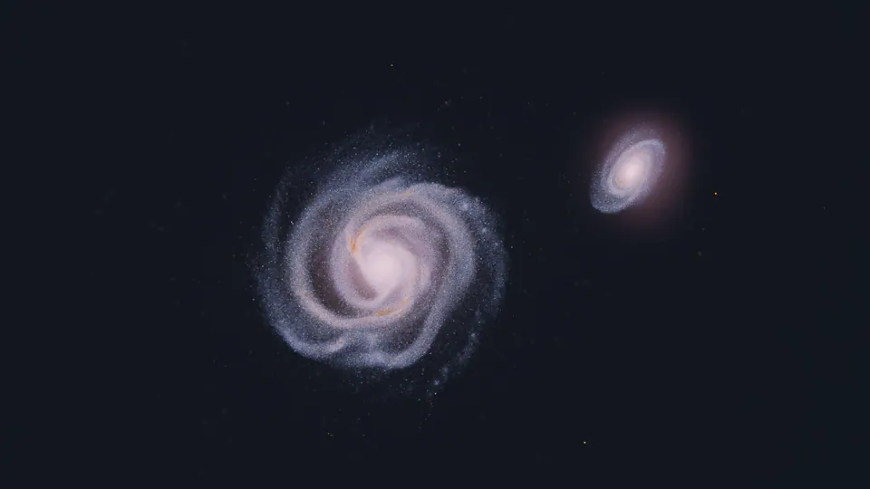

# Sillage

A hobby N-body simulator for galaxy collisions on Apple Silicon. The models are taken from the
standard literature, and what they are pointed at is a picture worth looking at rather than a
research result.



## Running it

macOS 14 or later on an Apple Silicon Mac.

```bash
git clone https://github.com/pierregc/sillage.git
cd sillage
./scripts/dev.sh app && open .build/dev/Sillage.app
```

The app opens on a setup screen: add galaxies, set their masses, radii, inclinations and spins,
then start the run. Drag to orbit, scroll to zoom, `F` to fly, space to pause. Presets are
`encounter`, `merger`, `flyby` and `disk`.

`./scripts/dev.sh test` runs the suite, and `./scripts/dev.sh render` writes an image sequence
without opening a window, which is how the animation above was made. Everything goes through
that script rather than SwiftPM: with only the Command Line Tools installed, no manifest will
compile. Shaders are built at runtime, so Xcode is not needed either way.

## The physics

Two solvers share one scene description, one particle buffer and one renderer. **Restricted**
moves massless test particles through rigid analytic potentials, following Toomre and Toomre
(1972), at O(N); it raises the bridges and tails cheaply, which is useful while framing a shot.
**Barnes-Hut** gives the particles mass and a tree built in Morton order on the CPU and
traversed on the GPU, at O(N log N). Dark halos become particles too, so an infalling companion
raises a wake that drags on it, and the disks grow their own bars and arms. The images above
use Barnes-Hut.

**Integrator.** Kick drift kick leapfrog in both solvers, at a fixed step. The step and the
force softening are derived from the scene rather than exposed: softening is 1.5 times the mean
interparticle spacing of the densest disk, capped at 1 kpc, and the step is short enough that a
particle crosses well under one softening length per step.

**Units.** Lengths in kpc, masses in 10^10 solar masses, G = 1. The derived velocity unit is
207.4 km/s and the time unit is 4.71 Myr.

**Parameters.** Per scene: particle count, opening angle, halo particle ratio. Per galaxy:
mass, scale radius, truncation, thickness, Toomre Q, inclination, position angle and spin.

### Known limits

- Single precision throughout: positions, velocities and forces are all 32 bit floats.
- No hydrodynamics. No gas, no pressure, no shocks. The dissipation time is a relaxation term
  standing in for the gas that keeps a real disk cool, not a fluid solver.
- Star formation decides how a region is drawn and nothing else. It never feeds back into the
  forces.
- The step is fixed for the whole run rather than adaptive, so a deep pericentre is integrated
  no more finely than the approach.
- In restricted mode the halos are rigid and follow their galaxy, which does work on the
  system, so the pair never actually merges. The suite checks that live halos conserve momentum
  considerably better.
- None of this has been compared against a published simulation. The tests check internal
  consistency, equilibrium and conservation, not agreement with anyone else's results.

## Layout

```
Sources/SillageCore/     physics, no rendering dependency
Sources/SillageRender/   Metal solver, splat renderer, camera
Sources/SillageApp/      SwiftUI setup screen and live view
Sources/sillage-render/  headless PNG renderer
```

## Small print

AI did a good share of the typing here. Seemed worth saying out loud.

## License

MIT.
